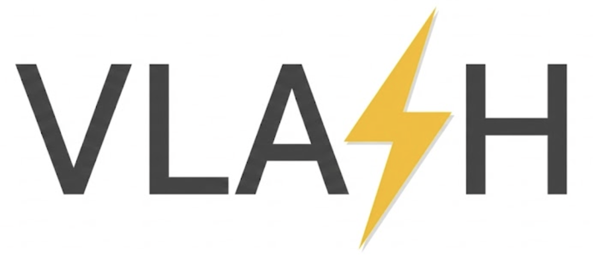

<!-- markdownlint-disable MD001 MD041 -->

<p align="center">
  <picture>
    
  </picture>
</p>
<h3 align="center">
Real-time VLA inference with FlashVLA - one denoise step per control tick.
</h3>

---

## About

FlashVLA turns chunked flow-matching VLAs (&pi;<sub>0.5</sub>, &pi;<sub>0</sub>, SmolVLA) into **streaming** policies: instead of paying a full multi-step ODE solve at every chunk boundary, FlashVLA keeps a rolling buffer of N action chunks at staggered noise levels and advances the *whole buffer by one denoise step per inference call* - the head chunk comes out fully denoised and ready to execute, every call, at constant latency.

- **FlashVLA policy** - N-slot denoising buffer with padded cold start; steady-state inference is a single forward pass (encode + prefill + 1 denoise step)
- **Async chunk overlap** - `AsyncStreamingActionManager` launches the next chunk before the current one runs out; under `torch.compile` + CUDA graphs the launch is dispatch-only and inference hides behind robot/env stepping (p50 chunk-transition latency &asymp; 0.1 ms)
- **Shared-observation training** - all N buffer configurations trained per observation with a single VLM prefix pass and cross-config attention masking
- **Seamless [LeRobot](https://github.com/huggingface/lerobot) integration** - datasets (v2.1 / v3.0), pretrained models (`lerobot/pi05_base`), processors and sim envs

## Installation

```bash
conda env create -f environment.yml   # FlashVLA + LIBERO sim eval, in one resolution
conda activate flashvla
```

`environment.yml` installs the LIBERO simulation extra too. For a lean
train / benchmark / RoboTwin / real-robot env, change `-e .[libero]` to
`-e .` in `environment.yml` before creating it (those paths don't build the
native `egl_probe` extension). If you ever add LIBERO to an existing env *after*
the fact, do it as shown in [`sim_eval/libero/README.md`](sim_eval/libero/README.md)
— installing it as a second step needs one extra command (lerobot's bundled
`cmake` shim otherwise breaks the `egl_probe` source build).

That's it — **no custom `transformers` build is required**. FlashVLA installs
`lerobot[smolvla]==0.5.1` and uses `lerobot.policies.pi_gemma` (shipped in
that release) for adaRMS-capable Gemma/PaliGemma backbones, so the old
special transformers commit is not needed.

## Repository layout

The `flashvla` package is a pure library (policies, datasets, the async
manager); every workflow is a self-contained directory at the repo root:

```
flashvla/      the pip-installed library
train/         training scripts + configs/
sim_eval/      simulation evaluation (LIBERO, RoboTwin)
realworld/     real-robot deployment guide
benchmarks/    inference latency benchmark + configs/
```

## Quick Start

**Train a FlashVLA policy** (starts from `lerobot/pi05_base`):

```bash
python train/train.py --config_path=train/configs/pi05/libero/flashvla_action.yaml

# multi-GPU
accelerate launch --multi_gpu --num_processes=4 \
    train/train.py --config_path=train/configs/pi05/libero/flashvla_action.yaml
```

(`train/train_baseline.py` finetunes the plain pi05/pi0/smolvla baselines.)

**Evaluate on LIBERO** with async overlap:

```bash
python sim_eval/libero/eval.py \
    --policy.path=outputs/train/flashvla_action_libero/checkpoints/last/pretrained_model \
    --policy.compile_model=true --policy.fuse_qkv=true --policy.fuse_gate_up=true \
    --env.type=libero --env.task=libero_spatial \
    --eval.batch_size=1 --eval.n_episodes=50 \
    --policy.n_action_steps=5 --inference_overlap_steps=1 \
    --output_dir=outputs/eval --seed=1000
```

**Benchmark inference latency** (standalone scripts under [`benchmarks/`](benchmarks/)):

```bash
python benchmarks/benchmark_latency.py --config_path=benchmarks/configs/latency_flashvla.yaml
python benchmarks/benchmark_latency.py --config_path=benchmarks/configs/latency_baseline.yaml   # chunked baseline
```

## Evaluation

Simulation evaluation lives under [`sim_eval/`](sim_eval/); real-robot deployment under [`realworld/`](realworld/):

| Target | Where | Notes |
|---|---|---|
| **LIBERO** (sim) | [`sim_eval/libero/`](sim_eval/libero/) | `eval.py` single runs + multi-seed × multi-suite × multi-GPU orchestrator |
| **RoboTwin 2.0** (sim) | [`sim_eval/robotwin/`](sim_eval/robotwin/) | TCP client/server adapters + a small overlay onto upstream RoboTwin |
| **Real robot** | [`realworld/`](realworld/) | bring your own driver; integrate via `flashvla.async_manager.AsyncStreamingActionManager` |

## Supported policies

| `policy.type` | Backbone | Streaming |
|---|---|---|
| `pi05-flashvla` | PaliGemma 3B + 300M Gemma expert (adaRMS) | ✅ |
| `pi0-flashvla` | PaliGemma 3B + 300M Gemma expert (concat-time, optional adaRMS) | ✅ |
| `smolvla-flashvla` | SmolVLM2-500M + Llama expert (optional adaRMS) | ✅ |
| `pi05` / `pi0` / `smolvla` | baselines for finetuning & comparison | — |

Key streaming knobs (see `train/configs/*/flashvla_action*.yaml`): `num_buffer_slots` (N), `chunk_size` (C), `n_action_steps`, `timestep_sample_mode` (`per-sample` recommended), `cold_start_mode` (`zero_delta` for delta-action robots, `current_state` for absolute-position robots), `use_action_prefix`.

## Acknowledgment

This project is built upon the following excellent open-source projects: [LeRobot](https://github.com/huggingface/lerobot), [RoboTwin](https://github.com/RoboTwin-Platform/RoboTwin).

## License

Apache 2.0
